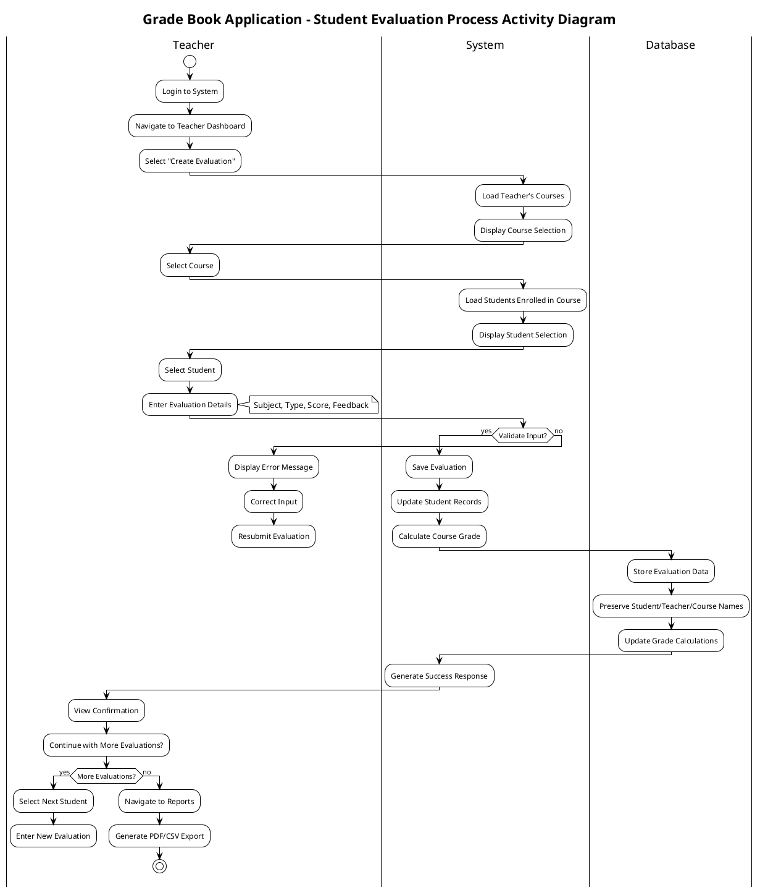
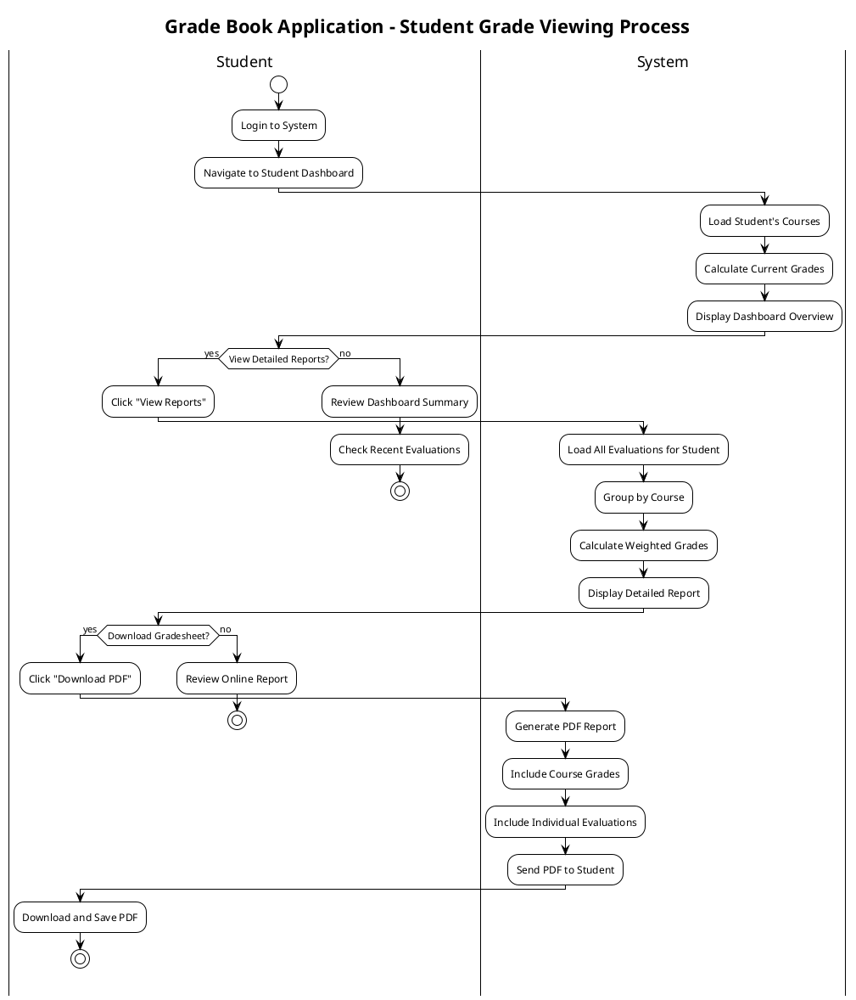
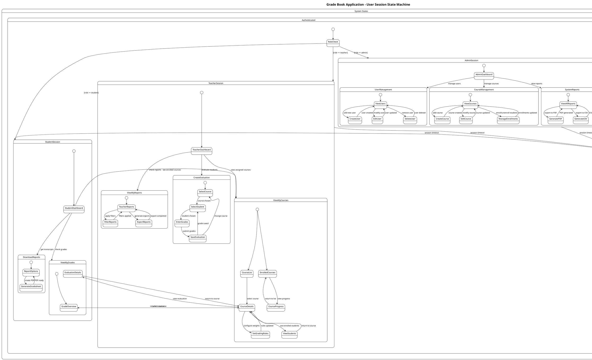
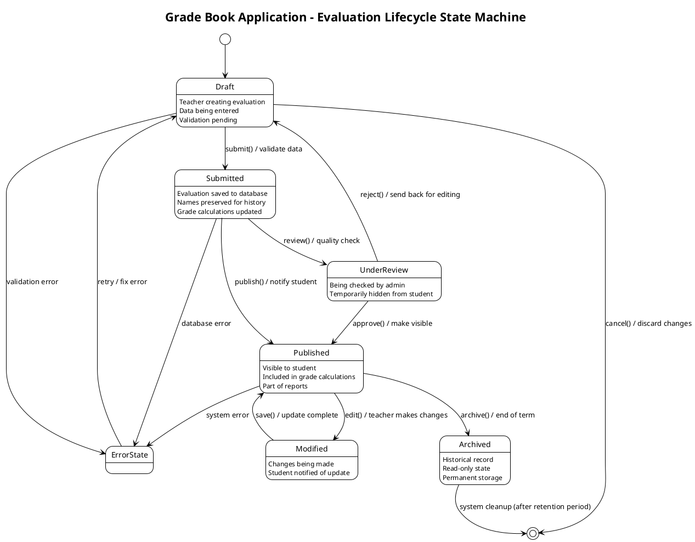

# Grade Book Application - Comprehensive UML Diagrams

## 1. Use Case Diagram

```plantuml
@startuml use_case_diagram
!theme plain

title Grade Book Application - Use Case Diagram

actor Admin
actor Teacher  
actor Student

package "Authentication System" {
  usecase "Login" as UC1
  usecase "Logout" as UC2
  usecase "Change Password" as UC3
}

package "User Management" {
  usecase "Create User" as UC4
  usecase "Edit User" as UC5
  usecase "Delete User" as UC6
  usecase "View Users" as UC7
}

package "Course Management" {
  usecase "Create Course" as UC8
  usecase "Edit Course" as UC9
  usecase "Delete Course" as UC10
  usecase "View Courses" as UC11
  usecase "Enroll Students" as UC12
  usecase "Unenroll Students" as UC13
  usecase "Set Grading Rules" as UC14
}

package "Evaluation Management" {
  usecase "Create Evaluation" as UC15
  usecase "Edit Evaluation" as UC16
  usecase "Delete Evaluation" as UC17
  usecase "View Evaluations" as UC18
  usecase "Grade Students" as UC19
}

package "Reporting System" {
  usecase "View Reports" as UC20
  usecase "Export PDF" as UC21
  usecase "Export CSV" as UC22
  usecase "View Student Progress" as UC23
  usecase "Download Gradesheet" as UC24
}

package "Dashboard Views" {
  usecase "Admin Dashboard" as UC25
  usecase "Teacher Dashboard" as UC26
  usecase "Student Dashboard" as UC27
}

' User relationships
Admin --> UC1
Admin --> UC2
Admin --> UC3
Teacher --> UC1
Teacher --> UC2
Teacher --> UC3
Student --> UC1
Student --> UC2

' Admin permissions
Admin --> UC4
Admin --> UC5
Admin --> UC6
Admin --> UC7
Admin --> UC8
Admin --> UC9
Admin --> UC10
Admin --> UC11
Admin --> UC12
Admin --> UC13
Admin --> UC14
Admin --> UC15
Admin --> UC16
Admin --> UC17
Admin --> UC18
Admin --> UC20
Admin --> UC21
Admin --> UC22
Admin --> UC25

' Teacher permissions
Teacher --> UC11
Teacher --> UC14
Teacher --> UC15
Teacher --> UC16
Teacher --> UC18
Teacher --> UC19
Teacher --> UC20
Teacher --> UC21
Teacher --> UC22
Teacher --> UC26

' Student permissions
Student --> UC18
Student --> UC20
Student --> UC23
Student --> UC24
Student --> UC27

' Extensions and includes
UC15 .> UC19 : <<include>>
UC20 .> UC21 : <<extend>>
UC20 .> UC22 : <<extend>>
UC18 .> UC23 : <<extend>>

@enduml
```

## 2. Class Diagram

```plantuml
@startuml class_diagram
!theme plain

title Grade Book Application - Class Diagram

package "Models" {
  class User {
    -id: Integer
    -name: String
    -email: String
    -password: String
    -role: String
    -created_at: DateTime
    +getAll(): User[]
    +getById(id: Integer): User
    +getByEmail(email: String): User
    +create(userData: Object): Integer
    +update(id: Integer, userData: Object): Boolean
    +delete(id: Integer): Boolean
    +getStudentsByTeacher(teacherId: Integer): User[]
    +getTeachers(): User[]
    +getStudents(): User[]
    +assignStudentToTeacher(studentId: Integer, teacherId: Integer): Boolean
    +unassignStudentFromTeacher(studentId: Integer, teacherId: Integer): Boolean
  }

  class Course {
    -id: Integer
    -name: String
    -description: String
    -teacher_id: Integer
    -created_at: DateTime
    +getAll(): Course[]
    +getByTeacher(teacherId: Integer): Course[]
    +getById(id: Integer): Course
    +create(courseData: Object): Integer
    +update(id: Integer, courseData: Object): Boolean
    +delete(id: Integer): Boolean
    +enrollStudent(studentId: Integer, courseId: Integer): Boolean
    +unenrollStudent(studentId: Integer, courseId: Integer): Boolean
    +getEnrollments(courseId: Integer): Object[]
    +getCourseStudents(courseId: Integer): User[]
    +getAvailableStudents(courseId: Integer): User[]
    +getGradingRules(courseId: Integer): Object
    +updateGradingRules(courseId: Integer, rules: Object): Boolean
  }

  class Evaluation {
    -id: Integer
    -student_id: Integer
    -teacher_id: Integer
    -course_id: Integer
    -student_name: String
    -teacher_name: String
    -course_name: String
    -subject: String
    -evaluation_type: String
    -score: Integer
    -feedback: String
    -date_created: DateTime
    +create(evaluationData: Object): Integer
    +getByStudentId(studentId: Integer): Evaluation[]
    +getByTeacherId(teacherId: Integer): Evaluation[]
    +getByCourseId(courseId: Integer): Evaluation[]
    +getAll(): Evaluation[]
    +getById(id: Integer): Evaluation
    +update(id: Integer, evaluationData: Object): Boolean
    +delete(id: Integer): Boolean
    +getStats(): Object
    +getCourseGrades(studentId: Integer): Object[]
    +calculateFinalGrade(studentId: Integer, courseId: Integer): Object
  }

  class CourseEnrollment {
    -id: Integer
    -student_id: Integer
    -course_id: Integer
    -enrolled_at: DateTime
  }

  class CourseGradingRules {
    -id: Integer
    -course_id: Integer
    -participation_weight: Integer
    -homework_weight: Integer
    -exam_weight: Integer
    -project_weight: Integer
    -quiz_weight: Integer
    -updated_at: DateTime
  }
}

package "Controllers" {
  class AuthController {
    +login(req: Request, res: Response): void
    +register(req: Request, res: Response): void
    +profile(req: Request, res: Response): void
  }

  class UsersController {
    +getAll(req: Request, res: Response): void
    +getById(req: Request, res: Response): void
    +create(req: Request, res: Response): void
    +update(req: Request, res: Response): void
    +delete(req: Request, res: Response): void
    +getStudentsByTeacher(req: Request, res: Response): void
    +getTeachers(req: Request, res: Response): void
    +getStudents(req: Request, res: Response): void
    +assignStudentToTeacher(req: Request, res: Response): void
    +unassignStudentFromTeacher(req: Request, res: Response): void
    +getTeacherAssignments(req: Request, res: Response): void
  }

  class CoursesController {
    +getAll(req: Request, res: Response): void
    +getByTeacher(req: Request, res: Response): void
    +getById(req: Request, res: Response): void
    +create(req: Request, res: Response): void
    +update(req: Request, res: Response): void
    +delete(req: Request, res: Response): void
    +enrollStudent(req: Request, res: Response): void
    +unenrollStudent(req: Request, res: Response): void
    +getEnrollments(req: Request, res: Response): void
    +getCourseStudents(req: Request, res: Response): void
    +getAvailableStudents(req: Request, res: Response): void
    +getGradingRules(req: Request, res: Response): void
    +updateGradingRules(req: Request, res: Response): void
  }

  class EvaluationsController {
    +create(req: Request, res: Response): void
    +getByStudentId(req: Request, res: Response): void
    +getByTeacherId(req: Request, res: Response): void
    +getByCourseId(req: Request, res: Response): void
    +getAll(req: Request, res: Response): void
    +getById(req: Request, res: Response): void
    +update(req: Request, res: Response): void
    +delete(req: Request, res: Response): void
    +getStats(req: Request, res: Response): void
    +getCourseGrades(req: Request, res: Response): void
    +calculateFinalGrade(req: Request, res: Response): void
    +generatePDFReport(req: Request, res: Response): void
    +generateCSVReport(req: Request, res: Response): void
  }
}

package "Services" {
  class AuthService {
    -currentUser: Object
    -token: String
    -API_BASE: String
    +login(credentials: Object): Promise
    +logout(): void
    +getCurrentUser(): Object
    +getToken(): String
    +isAuthenticated(): Boolean
    +requireRole(role: String): Promise
    +hasRole(role: String): Boolean
    +redirectToDashboard(): void
  }

  class ApiServiceNew {
    -API_BASE: String
    +getApiBase(): String
    +users: Object
    +courses: Object
    +evaluations: Object
    +getUsers(): Promise
    +createUser(userData: Object): Promise
    +updateUser(userId: Integer, userData: Object): Promise
    +deleteUser(userId: Integer): Promise
    +getCourses(): Promise
    +createCourse(courseData: Object): Promise
    +deleteCourse(courseId: Integer): Promise
    +enrollStudent(studentId: Integer, courseId: Integer): Promise
    +unenrollStudent(studentId: Integer, courseId: Integer): Promise
    +getEvaluations(): Promise
    +createEvaluation(evaluationData: Object): Promise
    +updateEvaluation(evaluationId: Integer, evaluationData: Object): Promise
    +deleteEvaluation(evaluationId: Integer): Promise
  }
}

package "Middleware" {
  class AuthMiddleware {
    +verifyToken(req: Request, res: Response, next: Function): void
    +adminOnly(req: Request, res: Response, next: Function): void
    +teacherOnly(req: Request, res: Response, next: Function): void
    +studentOnly(req: Request, res: Response, next: Function): void
    +teacherOrAdmin(req: Request, res: Response, next: Function): void
  }
}

' Relationships
User ||--o{ Course : "teaches"
User ||--o{ CourseEnrollment : "enrolls"
Course ||--o{ CourseEnrollment : "has students"
Course ||--|| CourseGradingRules : "has rules"
Course ||--o{ Evaluation : "contains"
User ||--o{ Evaluation : "receives/gives"

' Controllers use Models
UsersController --> User
CoursesController --> Course
EvaluationsController --> Evaluation
AuthController --> User

' Services use Controllers
AuthService --> AuthController
ApiServiceNew --> UsersController
ApiServiceNew --> CoursesController
ApiServiceNew --> EvaluationsController

' Middleware protects Controllers
AuthMiddleware --> UsersController
AuthMiddleware --> CoursesController
AuthMiddleware --> EvaluationsController

@enduml
```

## 3. Activity Diagram

### Alternative Activity Diagram - Student Grade Viewing Process

## 4. State Machine Diagram

### Alternative State Machine - Evaluation Lifecycle

## Summary

These UML diagrams provide a comprehensive view of your Grade Book application:

### 1. **Use Case Diagram**
- Shows all system functionalities
- Defines user roles and permissions
- Illustrates relationships between actors and use cases
- Covers authentication, management, evaluation, and reporting features

### 2. **Class Diagram**
- Details all system classes and their relationships
- Shows complete API structure with models, controllers, and services
- Illustrates database relationships and dependencies
- Includes authentication middleware and service layers

### 3. **Activity Diagram**
- Demonstrates the student evaluation workflow
- Shows decision points and parallel activities
- Includes validation and error handling paths
- Covers both teacher and student perspectives

### 4. **State Machine Diagram**
- Models user session states based on roles
- Shows navigation between different system areas
- Includes session management and timeout handling
- Covers the complete evaluation lifecycle

These diagrams can be used for:
- **Documentation**: Understanding system architecture
- **Development**: Guiding implementation decisions
- **Testing**: Identifying test scenarios and edge cases
- **Maintenance**: Understanding system behavior for troubleshooting
- **Training**: Teaching new developers about the system

To generate visual diagrams from these PlantUML codes, you can use online tools like [PlantText](http://www.plantuml.com/plantuml/) or install PlantUML locally.
