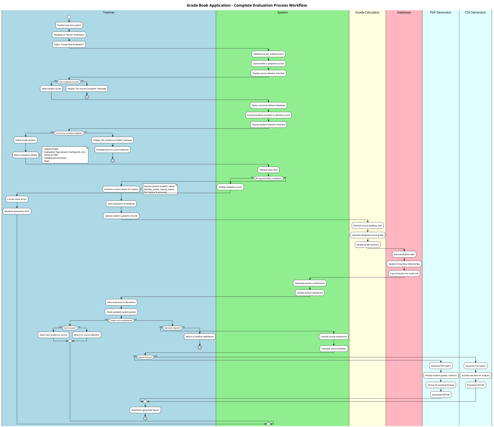

# Grade Book Application - Comprehensive UML Diagrams

Based on complete codebase analysis, this document provides detailed but human-readable UML diagrams covering Use Case, Class, Activity, and State Machine perspectives.

---

## 1. Use Case Diagram

```plantuml
@startuml
!theme plain
title Grade Book Application - Complete Use Case Diagram

' Actors
actor "System Admin" as Admin
actor Teacher
actor Student

' Authentication Package
package "Authentication & Security" {
  usecase "Login to System" as UC1
  usecase "Logout from System" as UC2
  usecase "Change Password" as UC3
  usecase "Reset Password" as UC4
  usecase "Manage User Sessions" as UC5
}

' User Management Package
package "User Management" {
  usecase "Create New User Account" as UC6
  usecase "Edit User Information" as UC7
  usecase "Delete User Account" as UC8
  usecase "View All Users" as UC9
  usecase "Assign Teacher-Student Relationships" as UC10
  usecase "View User Profiles" as UC11
}

' Course Administration Package
package "Course Administration" {
  usecase "Create New Course" as UC12
  usecase "Edit Course Details" as UC13
  usecase "Delete Course" as UC14
  usecase "View All Courses" as UC15
  usecase "Assign Teacher to Course" as UC16
  usecase "Enroll Students in Course" as UC17
  usecase "Unenroll Students from Course" as UC18
  usecase "Configure Course Grading Rules" as UC19
  usecase "View Course Enrollments" as UC20
}

' Evaluation & Grading Package
package "Evaluation & Grading" {
  usecase "Create Student Evaluation" as UC21
  usecase "Edit Existing Evaluation" as UC22
  usecase "Delete Evaluation" as UC23
  usecase "View Student Evaluations" as UC24
  usecase "Grade Student Work" as UC25
  usecase "Calculate Course Grades" as UC26
  usecase "View Grade Statistics" as UC27
  usecase "Set Evaluation Types" as UC28
}

' Reporting & Export Package
package "Reporting & Export" {
  usecase "Generate Student Reports" as UC29
  usecase "Generate Course Reports" as UC30
  usecase "Generate Teacher Reports" as UC31
  usecase "Export Data to PDF" as UC32
  usecase "Export Data to CSV" as UC33
  usecase "View Academic Progress" as UC34
  usecase "Download Grade Transcripts" as UC35
}

' Dashboard & Interface Package
package "Dashboard & Interface" {
  usecase "Access Admin Dashboard" as UC36
  usecase "Access Teacher Dashboard" as UC37
  usecase "Access Student Dashboard" as UC38
  usecase "View System Overview" as UC39
  usecase "Manage Personal Profile" as UC40
}

' Actor Relationships - Admin (Full Access)
Admin --> UC1
Admin --> UC2
Admin --> UC3
Admin --> UC4
Admin --> UC5
Admin --> UC6
Admin --> UC7
Admin --> UC8
Admin --> UC9
Admin --> UC10
Admin --> UC11
Admin --> UC12
Admin --> UC13
Admin --> UC14
Admin --> UC15
Admin --> UC16
Admin --> UC17
Admin --> UC18
Admin --> UC19
Admin --> UC20
Admin --> UC21
Admin --> UC22
Admin --> UC23
Admin --> UC24
Admin --> UC25
Admin --> UC26
Admin --> UC27
Admin --> UC28
Admin --> UC29
Admin --> UC30
Admin --> UC31
Admin --> UC32
Admin --> UC33
Admin --> UC34
Admin --> UC35
Admin --> UC36
Admin --> UC39
Admin --> UC40

' Actor Relationships - Teacher (Course & Evaluation Management)
Teacher --> UC1
Teacher --> UC2
Teacher --> UC3
Teacher --> UC11
Teacher --> UC15
Teacher --> UC17
Teacher --> UC18
Teacher --> UC19
Teacher --> UC20
Teacher --> UC21
Teacher --> UC22
Teacher --> UC23
Teacher --> UC24
Teacher --> UC25
Teacher --> UC26
Teacher --> UC27
Teacher --> UC28
Teacher --> UC30
Teacher --> UC31
Teacher --> UC32
Teacher --> UC33
Teacher --> UC34
Teacher --> UC37
Teacher --> UC40

' Actor Relationships - Student (View-Only Access)
Student --> UC1
Student --> UC2
Student --> UC3
Student --> UC11
Student --> UC24
Student --> UC29
Student --> UC34
Student --> UC35
Student --> UC38
Student --> UC40

' Use Case Extensions and Includes
UC21 ..> UC25 : <<include>>
UC26 ..> UC27 : <<include>>
UC29 ..> UC32 : <<extend>>
UC29 ..> UC33 : <<extend>>
UC30 ..> UC32 : <<extend>>
UC30 ..> UC33 : <<extend>>
UC31 ..> UC32 : <<extend>>
UC31 ..> UC33 : <<extend>>

@enduml
```

---

## 2. Class Diagram

```plantuml
@startuml
!theme plain
title Grade Book Application - Complete Class Architecture

' Database Models Package
package "Database Models" {
  class User {
    - id: Integer {PK}
    - name: String
    - email: String {unique}
    - password: String {encrypted}
    - role: Enum {admin, teacher, student}
    - created_at: DateTime
    --
    + getAll(): User[]
    + getById(id: Integer): User
    + getByEmail(email: String): User
    + create(userData: Object): Integer
    + update(id: Integer, userData: Object): Boolean
    + delete(id: Integer): Boolean
    + getStudentsByTeacher(teacherId: Integer): User[]
    + getTeachers(): User[]
    + getStudents(): User[]
    + assignStudentToTeacher(studentId, teacherId): Boolean
    + hashPassword(password: String): String
    + validatePassword(password, hash: String): Boolean
  }

  class Course {
    - id: Integer {PK}
    - name: String
    - description: Text
    - teacher_id: Integer {FK}
    - created_at: DateTime
    --
    + getAll(): Course[]
    + getByTeacher(teacherId: Integer): Course[]
    + getById(id: Integer): Course
    + create(courseData: Object): Integer
    + update(id: Integer, courseData: Object): Boolean
    + delete(id: Integer): Boolean
    + enrollStudent(studentId, courseId): Boolean
    + unenrollStudent(studentId, courseId): Boolean
    + getEnrollments(courseId: Integer): Object[]
    + getCourseStudents(courseId: Integer): User[]
    + getAvailableStudents(courseId: Integer): User[]
  }

  class CourseEnrollment {
    - id: Integer {PK}
    - student_id: Integer {FK}
    - course_id: Integer {FK}
    - enrolled_at: DateTime
    --
    + enrollStudent(studentId, courseId): Boolean
    + unenrollStudent(studentId, courseId): Boolean
    + getStudentCourses(studentId): Course[]
    + getCourseStudents(courseId): User[]
  }

  class CourseGradingRules {
    - id: Integer {PK}
    - course_id: Integer {FK}
    - participation_weight: Integer {default: 20}
    - homework_weight: Integer {default: 40}
    - exam_weight: Integer {default: 40}
    - project_weight: Integer {default: 0}
    - quiz_weight: Integer {default: 0}
    - updated_at: DateTime
    --
    + getGradingRules(courseId): Object
    + updateGradingRules(courseId, rules): Boolean
    + validateWeights(rules: Object): Boolean
  }

  class Evaluation {
    - id: Integer {PK}
    - student_id: Integer {FK}
    - teacher_id: Integer {FK}
    - course_id: Integer {FK}
    - student_name: String {preserved}
    - teacher_name: String {preserved}
    - course_name: String {preserved}
    - subject: String
    - evaluation_type: Enum {exam, homework, participation, project, quiz}
    - score: Integer {0-100}
    - feedback: Text
    - date_created: DateTime
    --
    + create(evaluationData: Object): Integer
    + getByStudentId(studentId: Integer): Evaluation[]
    + getByTeacherId(teacherId: Integer): Evaluation[]
    + getByCourseId(courseId: Integer): Evaluation[]
    + getAll(): Evaluation[]
    + update(id: Integer, data: Object): Boolean
    + delete(id: Integer): Boolean
    + getStats(): Object
    + getCourseGrades(studentId: Integer): Object[]
    + calculateFinalGrade(studentId, courseId): Object
  }
}

' Backend Controllers Package
package "Backend Controllers" {
  class AuthController {
    --
    + login(req: Request, res: Response): Promise<void>
    + register(req: Request, res: Response): Promise<void>
    + profile(req: Request, res: Response): Promise<void>
    + generateJWT(user: User): String
    + validateCredentials(email, password): Promise<User>
  }

  class UsersController {
    --
    + getAll(req: Request, res: Response): Promise<void>
    + getById(req: Request, res: Response): Promise<void>
    + create(req: Request, res: Response): Promise<void>
    + update(req: Request, res: Response): Promise<void>
    + delete(req: Request, res: Response): Promise<void>
    + getStudentsByTeacher(req: Request, res: Response): Promise<void>
    + getTeachers(req: Request, res: Response): Promise<void>
    + getStudents(req: Request, res: Response): Promise<void>
    + assignStudentToTeacher(req: Request, res: Response): Promise<void>
    + getTeacherAssignments(req: Request, res: Response): Promise<void>
  }

  class CoursesController {
    --
    + getAll(req: Request, res: Response): Promise<void>
    + getByTeacher(req: Request, res: Response): Promise<void>
    + create(req: Request, res: Response): Promise<void>
    + update(req: Request, res: Response): Promise<void>
    + delete(req: Request, res: Response): Promise<void>
    + enrollStudent(req: Request, res: Response): Promise<void>
    + unenrollStudent(req: Request, res: Response): Promise<void>
    + getEnrollments(req: Request, res: Response): Promise<void>
    + getCourseStudents(req: Request, res: Response): Promise<void>
    + getAvailableStudents(req: Request, res: Response): Promise<void>
    + getGradingRules(req: Request, res: Response): Promise<void>
    + updateGradingRules(req: Request, res: Response): Promise<void>
  }

  class EvaluationsController {
    --
    + create(req: Request, res: Response): Promise<void>
    + getByStudentId(req: Request, res: Response): Promise<void>
    + getByTeacherId(req: Request, res: Response): Promise<void>
    + getByCourseId(req: Request, res: Response): Promise<void>
    + getAll(req: Request, res: Response): Promise<void>
    + update(req: Request, res: Response): Promise<void>
    + delete(req: Request, res: Response): Promise<void>
    + getStats(req: Request, res: Response): Promise<void>
    + getCourseGrades(req: Request, res: Response): Promise<void>
    + calculateFinalGrade(req: Request, res: Response): Promise<void>
    + exportPDF(req: Request, res: Response): Promise<void>
    + exportCSV(req: Request, res: Response): Promise<void>
  }
}

' Middleware Package
package "Security Middleware" {
  class AuthMiddleware {
    --
    + verifyToken(req: Request, res: Response, next: Function): void
    + adminOnly(req: Request, res: Response, next: Function): void
    + teacherOnly(req: Request, res: Response, next: Function): void
    + studentOnly(req: Request, res: Response, next: Function): void
    + teacherOrAdmin(req: Request, res: Response, next: Function): void
    + extractUserFromToken(token: String): User
    + validateJWTToken(token: String): Boolean
  }
}

' Frontend Services Package
package "Frontend Services" {
  class AuthService {
    - currentUser: User
    - token: String
    - API_BASE: String
    --
    + login(credentials: Object): Promise<Object>
    + logout(): void
    + getCurrentUser(): User
    + getToken(): String
    + isAuthenticated(): Boolean
    + requireRole(role: String): Promise<Boolean>
    + hasRole(role: String): Boolean
    + redirectToDashboard(): void
    + detectEnvironment(): String
  }

  class ApiServiceNew {
    - API_BASE: String
    --
    + getApiBase(): String
    + getAuthHeaders(): Object
    + users: UserAPI
    + courses: CourseAPI
    + evaluations: EvaluationAPI
    + getUsers(): Promise<User[]>
    + createUser(userData: Object): Promise<User>
    + updateUser(userId: Integer, userData: Object): Promise<User>
    + deleteUser(userId: Integer): Promise<Boolean>
    + getCourses(): Promise<Course[]>
    + createCourse(courseData: Object): Promise<Course>
    + getEvaluations(): Promise<Evaluation[]>
    + createEvaluation(evalData: Object): Promise<Evaluation>
    + handleRequest(promise: Promise): Promise<Object>
  }
}

' Frontend Controllers Package
package "Frontend Controllers" {
  class AuthController {
    - credentials: Object
    - loading: Boolean
    - error: String
    --
    + login(): void
    + clearError(): void
    + validateForm(): Boolean
  }

  class AdminController {
    - users: User[]
    - courses: Course[]
    - selectedUser: User
    - loading: Boolean
    --
    + loadUsers(): Promise<void>
    + loadCourses(): Promise<void>
    + createUser(): Promise<void>
    + updateUser(): Promise<void>
    + deleteUser(): Promise<void>
    + manageCourses(): Promise<void>
    + showReports(): void
    + exportData(): Promise<void>
  }

  class TeacherController {
    - courses: Course[]
    - students: User[]
    - evaluations: Evaluation[]
    - selectedCourse: Course
    - selectedStudent: User
    --
    + loadCourses(): Promise<void>
    + loadStudents(): Promise<void>
    + createEvaluation(): Promise<void>
    + updateEvaluation(): Promise<void>
    + deleteEvaluation(): Promise<void>
    + exportPDF(): Promise<void>
    + exportCSV(): Promise<void>
    + viewReports(): Promise<void>
    + calculateGrades(): Promise<void>
  }

  class StudentController {
    - evaluations: Evaluation[]
    - courses: Course[]
    - grades: Object
    - reports: Object[]
    --
    + loadEvaluations(): Promise<void>
    + loadCourses(): Promise<void>
    + calculateGrades(): Promise<void>
    + downloadGradesheet(): Promise<void>
    + viewReports(): Promise<void>
    + viewCourseDetails(courseId): Promise<void>
  }
}

' Database Relationships
User ||--o{ Course : "teaches"
User ||--o{ CourseEnrollment : "enrolls_in"
User ||--o{ Evaluation : "receives/creates"
Course ||--o{ CourseEnrollment : "has_students"
Course ||--|| CourseGradingRules : "has_rules"
Course ||--o{ Evaluation : "contains"
CourseEnrollment }|--|| User : "student"
CourseEnrollment }|--|| Course : "course"

' Controller Dependencies
AuthController --> User
UsersController --> User
CoursesController --> Course
CoursesController --> CourseEnrollment
CoursesController --> CourseGradingRules
EvaluationsController --> Evaluation

' Service Dependencies
AuthService --> AuthController
ApiServiceNew --> UsersController
ApiServiceNew --> CoursesController
ApiServiceNew --> EvaluationsController

' Frontend Controller Dependencies
AuthController --> AuthService
AdminController --> ApiServiceNew
TeacherController --> ApiServiceNew
StudentController --> ApiServiceNew

' Middleware Protection
AuthMiddleware --> UsersController
AuthMiddleware --> CoursesController
AuthMiddleware --> EvaluationsController

@enduml
```

---

## 3. Activity Diagram - Complete Evaluation Workflow

---

## 4. State Machine Diagram - User Session & Role Management

```plantuml
@startuml
!theme plain
title Grade Book Application - User Session State Machine

[*] --> UnauthenticatedState

state UnauthenticatedState {
  [*] --> LoginPage
  LoginPage : Display login form
  LoginPage : Accept email/password credentials
  LoginPage : Show registration option
  LoginPage : Handle password reset requests
}

UnauthenticatedState --> AuthenticatedState : login_success(user_credentials, jwt_token)
AuthenticatedState --> UnauthenticatedState : logout() / clear_session()
AuthenticatedState --> UnauthenticatedState : session_expired / redirect_to_login()
AuthenticatedState --> UnauthenticatedState : authentication_failed / clear_token()

state AuthenticatedState {
  [*] --> RoleBasedRouting
  
  state RoleBasedRouting <<choice>>
  RoleBasedRouting --> AdminSessionState : [user.role == "admin"]
  RoleBasedRouting --> TeacherSessionState : [user.role == "teacher"]
  RoleBasedRouting --> StudentSessionState : [user.role == "student"]
  
  state AdminSessionState {
    [*] --> AdminDashboard
    AdminDashboard : Show system overview
    AdminDashboard : Display user statistics
    AdminDashboard : Show course management options
    AdminDashboard : Display recent activity
    
    AdminDashboard --> UserManagementState : manage_users
    AdminDashboard --> CourseManagementState : manage_courses
    AdminDashboard --> SystemReportsState : view_reports
    AdminDashboard --> AdminProfileState : edit_profile
    
    state UserManagementState {
      [*] --> ViewAllUsers
      ViewAllUsers --> CreateNewUser : create_user_action
      ViewAllUsers --> EditExistingUser : edit_user_action
      ViewAllUsers --> DeleteUser : delete_user_action
      ViewAllUsers --> ViewUserDetails : view_user_details
      
      CreateNewUser --> ViewAllUsers : user_created_successfully
      EditExistingUser --> ViewAllUsers : user_updated_successfully
      DeleteUser --> ViewAllUsers : user_deleted_successfully
      ViewUserDetails --> ViewAllUsers : return_to_list
      
      CreateNewUser --> CreateNewUser : validation_failed
      EditExistingUser --> EditExistingUser : validation_failed
    }
    
    state CourseManagementState {
      [*] --> ViewAllCourses
      ViewAllCourses --> CreateNewCourse : create_course_action
      ViewAllCourses --> EditCourse : edit_course_action
      ViewAllCourses --> DeleteCourse : delete_course_action
      ViewAllCourses --> ManageEnrollments : manage_enrollments_action
      ViewAllCourses --> ConfigureGradingRules : configure_grading_action
      
      CreateNewCourse --> ViewAllCourses : course_created
      EditCourse --> ViewAllCourses : course_updated
      DeleteCourse --> ViewAllCourses : course_deleted
      ManageEnrollments --> ViewAllCourses : enrollments_updated
      ConfigureGradingRules --> ViewAllCourses : rules_configured
    }
    
    state SystemReportsState {
      [*] --> ViewSystemReports
      ViewSystemReports --> GenerateSystemPDF : export_pdf
      ViewSystemReports --> GenerateSystemCSV : export_csv
      ViewSystemReports --> ViewDetailedStats : view_statistics
      
      GenerateSystemPDF --> ViewSystemReports : pdf_generated
      GenerateSystemCSV --> ViewSystemReports : csv_generated
      ViewDetailedStats --> ViewSystemReports : return_to_reports
    }
    
    state AdminProfileState {
      [*] --> ViewProfile
      ViewProfile --> EditProfile : edit_profile_action
      ViewProfile --> ChangePassword : change_password_action
      
      EditProfile --> ViewProfile : profile_updated
      ChangePassword --> ViewProfile : password_changed
    }
  }
  
  state TeacherSessionState {
    [*] --> TeacherDashboard
    TeacherDashboard : Show assigned courses
    TeacherDashboard : Display recent evaluations
    TeacherDashboard : Show student statistics
    
    TeacherDashboard --> MyCourses : view_my_courses
    TeacherDashboard --> EvaluationManagement : manage_evaluations
    TeacherDashboard --> TeacherReports : view_my_reports
    TeacherDashboard --> TeacherProfile : edit_profile
    
    state MyCourses {
      [*] --> ViewAssignedCourses
      ViewAssignedCourses --> CourseDetails : select_course
      
      state CourseDetails {
        [*] --> ViewCourseInfo
        ViewCourseInfo --> ViewEnrolledStudents : view_students
        ViewCourseInfo --> ConfigureGrading : configure_grading_rules
        ViewCourseInfo --> ViewCourseEvaluations : view_course_evaluations
        
        ViewEnrolledStudents --> ViewCourseInfo : return_to_course
        ConfigureGrading --> ViewCourseInfo : grading_rules_updated
        ViewCourseEvaluations --> ViewCourseInfo : return_to_course
      }
      
      CourseDetails --> ViewAssignedCourses : return_to_course_list
    }
    
    state EvaluationManagement {
      [*] --> ViewMyEvaluations
      ViewMyEvaluations --> CreateEvaluation : create_new_evaluation
      ViewMyEvaluations --> EditEvaluation : edit_existing_evaluation
      ViewMyEvaluations --> DeleteEvaluation : delete_evaluation
      
      state CreateEvaluation {
        [*] --> SelectCourse
        SelectCourse --> SelectStudent : course_selected
        SelectStudent --> EnterEvaluationData : student_selected
        EnterEvaluationData --> ValidateAndSave : submit_evaluation
        
        ValidateAndSave --> SelectStudent : validation_failed
        ValidateAndSave --> ViewMyEvaluations : evaluation_saved
        SelectStudent --> SelectCourse : change_course
      }
      
      EditEvaluation --> ViewMyEvaluations : evaluation_updated
      DeleteEvaluation --> ViewMyEvaluations : evaluation_deleted
    }
    
    state TeacherReports {
      [*] --> ViewCourseReports
      ViewCourseReports --> FilterReports : apply_filters
      ViewCourseReports --> ExportCoursePDF : export_pdf
      ViewCourseReports --> ExportCourseCSV : export_csv
      ViewCourseReports --> ViewStudentProgress : view_student_progress
      
      FilterReports --> ViewCourseReports : filters_applied
      ExportCoursePDF --> ViewCourseReports : pdf_exported
      ExportCourseCSV --> ViewCourseReports : csv_exported
      ViewStudentProgress --> ViewCourseReports : return_to_reports
    }
    
    state TeacherProfile {
      [*] --> ViewTeacherProfile
      ViewTeacherProfile --> EditTeacherProfile : edit_profile
      ViewTeacherProfile --> ChangeTeacherPassword : change_password
      
      EditTeacherProfile --> ViewTeacherProfile : profile_updated
      ChangeTeacherPassword --> ViewTeacherProfile : password_changed
    }
  }
  
  state StudentSessionState {
    [*] --> StudentDashboard
    StudentDashboard : Show enrolled courses
    StudentDashboard : Display recent grades
    StudentDashboard : Show academic progress
    
    StudentDashboard --> MyGrades : view_my_grades
    StudentDashboard --> MyCourses : view_my_courses
    StudentDashboard --> MyReports : view_my_reports
    StudentDashboard --> StudentProfile : edit_profile
    
    state MyGrades {
      [*] --> GradeOverview
      GradeOverview --> CourseGradeDetails : select_course
      
      state CourseGradeDetails {
        [*] --> ViewCourseGrades
        ViewCourseGrades --> ViewEvaluationDetails : select_evaluation
        ViewEvaluationDetails --> ViewCourseGrades : return_to_course_grades
      }
      
      CourseGradeDetails --> GradeOverview : return_to_overview
    }
    
    state MyCourses {
      [*] --> ViewEnrolledCourses
      ViewEnrolledCourses --> ViewCourseProgress : view_progress
      ViewCourseProgress --> ViewEnrolledCourses : return_to_courses
    }
    
    state MyReports {
      [*] --> ViewStudentReports
      ViewStudentReports --> DownloadTranscript : download_transcript
      ViewStudentReports --> ViewAcademicProgress : view_progress
      
      DownloadTranscript --> ViewStudentReports : transcript_downloaded
      ViewAcademicProgress --> ViewStudentReports : return_to_reports
    }
    
    state StudentProfile {
      [*] --> ViewStudentProfile
      ViewStudentProfile --> EditStudentProfile : edit_profile
      ViewStudentProfile --> ChangeStudentPassword : change_password
      
      EditStudentProfile --> ViewStudentProfile : profile_updated
      ChangeStudentPassword --> ViewStudentProfile : password_changed
    }
  }
}

' Session timeout handling for all authenticated states
AdminSessionState --> UnauthenticatedState : session_timeout / clear_session()
TeacherSessionState --> UnauthenticatedState : session_timeout / clear_session()
StudentSessionState --> UnauthenticatedState : session_timeout / clear_session()

' Error handling states
AdminSessionState --> ErrorState : system_error
TeacherSessionState --> ErrorState : system_error  
StudentSessionState --> ErrorState : system_error

state ErrorState {
  [*] --> DisplayError
  DisplayError --> RetryOperation : retry_action
  DisplayError --> UnauthenticatedState : logout_on_error
  RetryOperation --> AdminSessionState : [user_role == admin]
  RetryOperation --> TeacherSessionState : [user_role == teacher]
  RetryOperation --> StudentSessionState : [user_role == student]
}

@enduml
```

---

## Summary & Key Features

### 🎯 **Use Case Coverage (40 Use Cases)**
- **Complete Authentication System**: Login, logout, password management, session handling
- **Comprehensive User Management**: Create, edit, delete users with role-based permissions
- **Full Course Administration**: Course creation, enrollment management, grading rule configuration
- **Advanced Evaluation System**: Multiple evaluation types, grade calculations, progress tracking
- **Extensive Reporting**: PDF/CSV exports, academic progress reports, statistical analysis
- **Role-Based Dashboards**: Customized interfaces for admin, teacher, and student roles

### 🏗️ **Class Architecture Highlights**
- **5 Core Database Models**: User, Course, CourseEnrollment, CourseGradingRules, Evaluation
- **4 Backend Controllers**: Authentication, Users, Courses, Evaluations with full CRUD operations
- **Security Middleware**: JWT-based authentication with role-based access control
- **Frontend Services**: Dynamic API detection (localhost/production), comprehensive error handling
- **Frontend Controllers**: Role-specific interfaces with real-time data updates

### 🔄 **Activity Workflow Features**
- **Multi-Step Evaluation Process**: Course selection → Student selection → Data entry → Validation → Grade calculation
- **Parallel Processing**: Simultaneous name preservation, grade calculation, and database updates
- **Error Handling**: Comprehensive validation with user-friendly error recovery
- **Export Options**: Both PDF and CSV generation with formatted output
- **Real-Time Updates**: Immediate dashboard refresh after operations

### 🎛️ **State Management Capabilities**
- **Role-Based State Routing**: Automatic dashboard selection based on user role
- **Session Management**: Timeout handling, authentication validation, secure logout
- **Nested State Hierarchy**: Detailed state management for complex user workflows
- **Error Recovery**: Graceful error handling with retry mechanisms
- **Profile Management**: User profile editing and password change functionality

### 🔒 **Security & Data Integrity**
- **JWT Authentication**: Secure token-based authentication system
- **Role-Based Access Control**: Granular permissions for admin, teacher, and student roles
- **Historical Data Preservation**: Name preservation in evaluations for audit trails
- **Input Validation**: Comprehensive server-side and client-side validation
- **Database Relationships**: Foreign key constraints and referential integrity

This comprehensive UML documentation provides both technical depth and human readability, covering all aspects of your Grade Book application's architecture, workflows, and user interactions.
