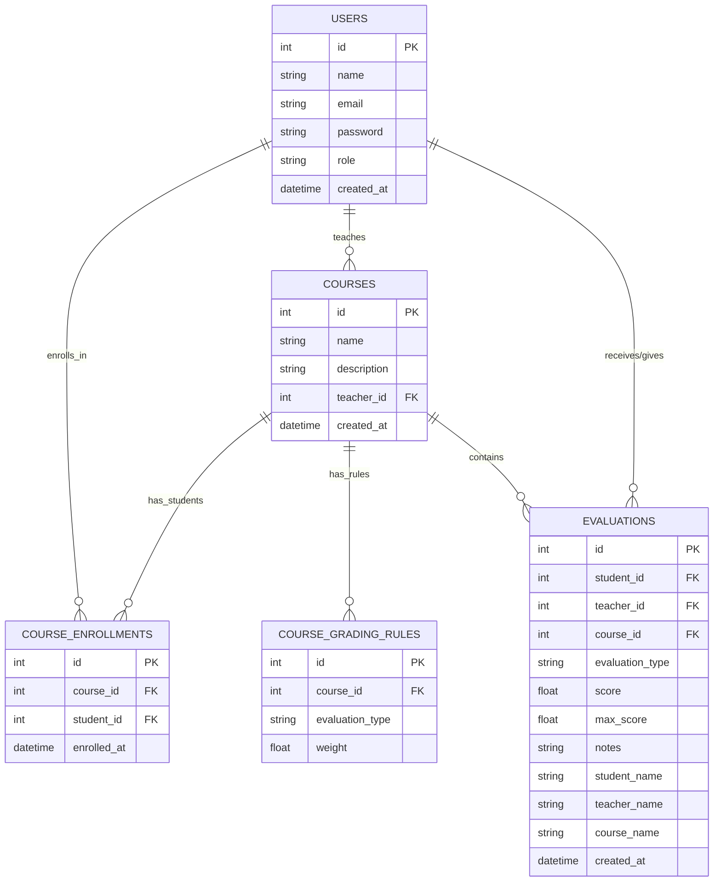
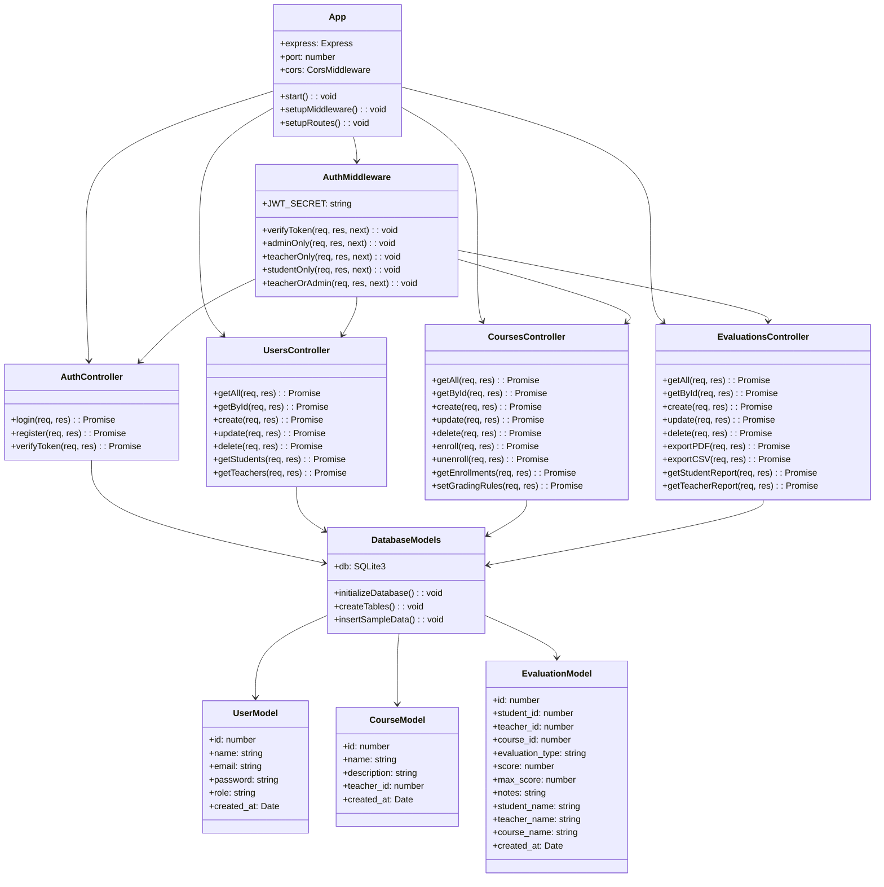
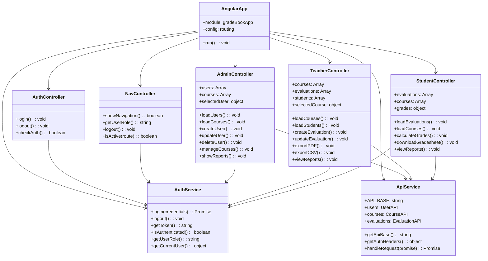
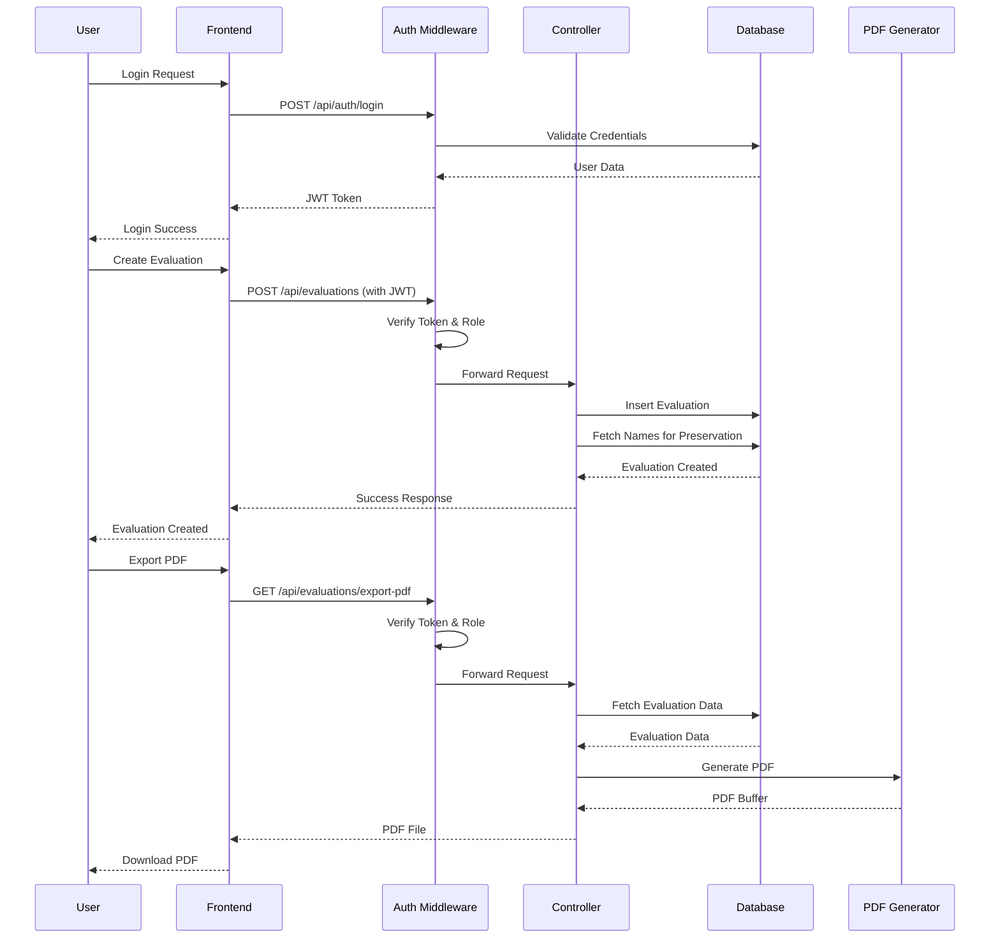
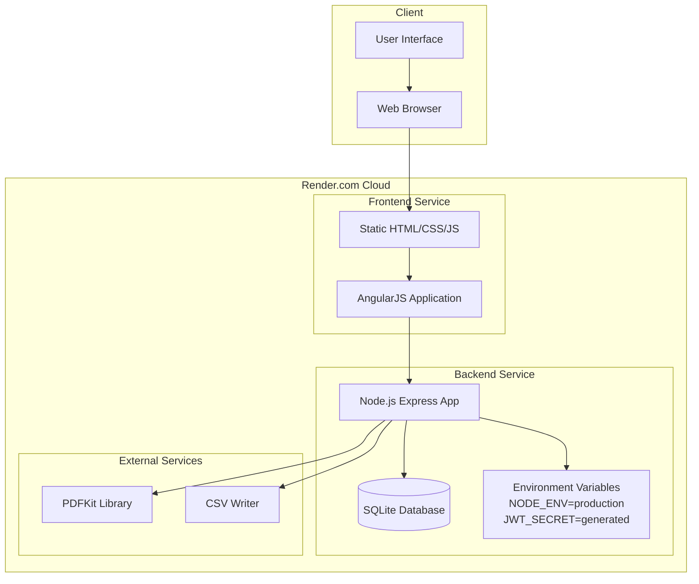

# Grade Book Application - UML Architecture Diagram

## System Overview
This UML diagram represents the complete Grade Book Application architecture, including database schema, backend API structure, frontend components, and their relationships.

## Database Schema (Entity Relationship Diagram)

## Backend Architecture (Class Diagram)

## Frontend Architecture (Component Diagram)

## System Flow Diagram (Sequence Diagram)

## Deployment Architecture

## Role-Based Access Control

```mermaid
graph TD
    subgraph "User Roles"
        ADMIN[Admin]
        TEACHER[Teacher]
        STUDENT[Student]
    end
    
    subgraph "Admin Permissions"
        ADMIN_USERS[Manage Users]
        ADMIN_COURSES[Manage Courses]
        ADMIN_REPORTS[View All Reports]
        ADMIN_EXPORT[Export All Data]
    end
    
    subgraph "Teacher Permissions"
        TEACHER_COURSES[View Assigned Courses]
        TEACHER_EVAL[Create/Edit Evaluations]
        TEACHER_STUDENTS[View Course Students]
        TEACHER_REPORTS[View Course Reports]
        TEACHER_EXPORT[Export Course Data]
    end
    
    subgraph "Student Permissions"
        STUDENT_GRADES[View Own Grades]
        STUDENT_COURSES[View Enrolled Courses]
        STUDENT_REPORTS[View Own Reports]
        STUDENT_PDF[Download Own Gradesheet]
    end
    
    ADMIN --> ADMIN_USERS
    ADMIN --> ADMIN_COURSES
    ADMIN --> ADMIN_REPORTS
    ADMIN --> ADMIN_EXPORT
    ADMIN --> TEACHER_COURSES
    ADMIN --> TEACHER_EVAL
    ADMIN --> TEACHER_STUDENTS
    ADMIN --> TEACHER_REPORTS
    ADMIN --> TEACHER_EXPORT
    
    TEACHER --> TEACHER_COURSES
    TEACHER --> TEACHER_EVAL
    TEACHER --> TEACHER_STUDENTS
    TEACHER --> TEACHER_REPORTS
    TEACHER --> TEACHER_EXPORT
    
    STUDENT --> STUDENT_GRADES
    STUDENT --> STUDENT_COURSES
    STUDENT --> STUDENT_REPORTS
    STUDENT --> STUDENT_PDF
```

## Key Features Architecture

1. **Authentication System**
   - JWT-based authentication
   - Role-based access control
   - Secure password hashing with bcrypt

2. **Course Management**
   - Course creation and enrollment
   - Teacher assignment
   - Grading rules configuration

3. **Evaluation System**
   - Multiple evaluation types
   - Weighted grade calculations
   - Historical name preservation

4. **Export Functionality**
   - PDF generation with PDFKit
   - CSV export capabilities
   - Role-based export permissions

5. **Data Integrity**
   - Foreign key relationships
   - Name preservation for deleted users
   - Comprehensive error handling

This UML diagram provides a complete overview of your Grade Book application's architecture, showing how all components interact to deliver a robust course-based grading system.
