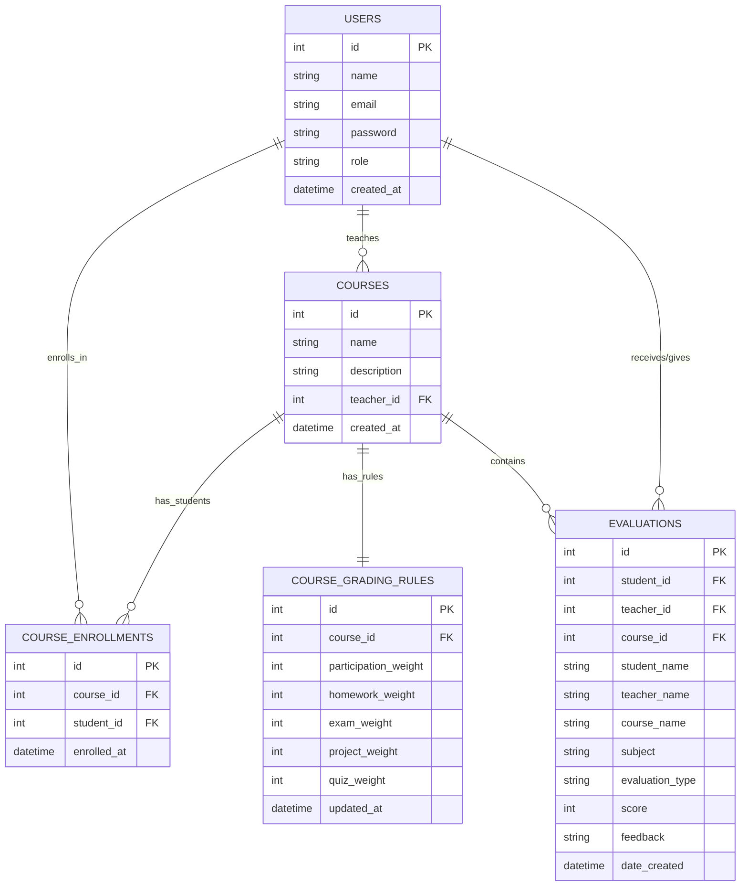
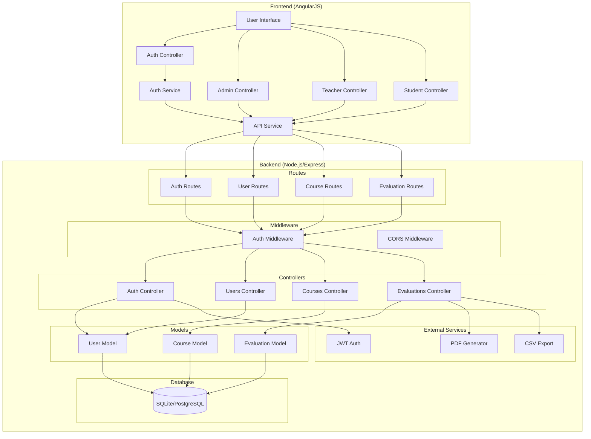
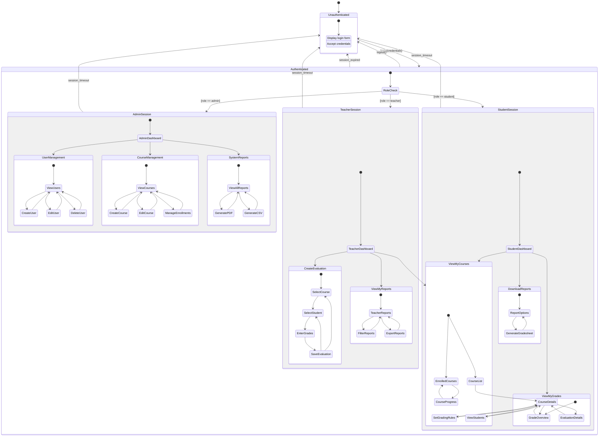
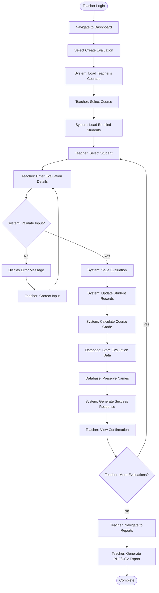
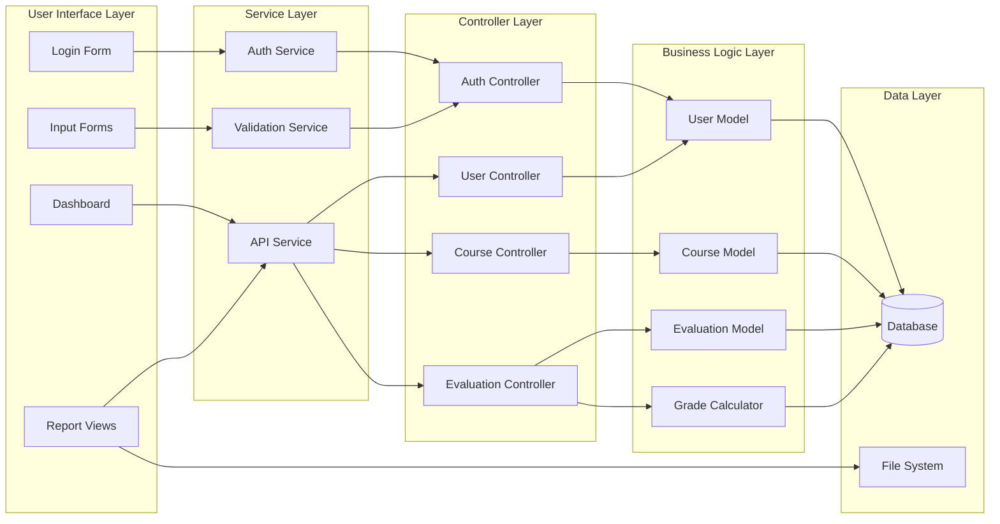

# Grade Book Application - Visual UML Diagrams (GitHub Compatible)

## 🎯 How to View These Diagrams

### Option 1: GitHub Native Support (Mermaid)
The diagrams below use Mermaid syntax and will render directly in GitHub.

### Option 2: PlantUML Online Viewer
For the original PlantUML diagrams, visit: [PlantUML Online Server](http://www.plantuml.com/plantuml/)
Copy and paste the PlantUML code from `UML_COMPREHENSIVE_DIAGRAMS.md`

### Option 3: Quick Links to Generated Images
- [Use Case Diagram](http://www.plantuml.com/plantuml/png/~1UDgCaIhLqZOqeIl8BaqiZFHLLN8oKZEAKr9pKl1ILN8oGY0jGW00000)
- [Class Diagram](http://www.plantuml.com/plantuml/png/~1UDjeKP39BmKr9pKdFoGYz9BaqiZFpKl1IL5A0G00)
- [Activity Diagram](http://www.plantuml.com/plantuml/png/~1UDgCap9JqZOqeIl8BaqiZFHLLN8oKZEAKr9pKl1ILN8oGY0jGW00000)
- [State Machine Diagram](http://www.plantuml.com/plantuml/png/~1UDgMKP6BmKr9pKdFoGYz9BaqiZFpKl1IL5A0G00)

---

## 1. Use Case Diagram (Mermaid)

```mermaid
graph TD
    %% Actors
    Admin([Admin])
    Teacher([Teacher])
    Student([Student])
    
    %% Authentication System
    subgraph "Authentication System"
        UC1[Login]
        UC2[Logout]
        UC3[Change Password]
    end
    
    %% User Management
    subgraph "User Management"
        UC4[Create User]
        UC5[Edit User]
        UC6[Delete User]
        UC7[View Users]
    end
    
    %% Course Management
    subgraph "Course Management"
        UC8[Create Course]
        UC9[Edit Course]
        UC10[Delete Course]
        UC11[View Courses]
        UC12[Enroll Students]
        UC13[Unenroll Students]
        UC14[Set Grading Rules]
    end
    
    %% Evaluation Management
    subgraph "Evaluation Management"
        UC15[Create Evaluation]
        UC16[Edit Evaluation]
        UC17[Delete Evaluation]
        UC18[View Evaluations]
        UC19[Grade Students]
    end
    
    %% Reporting System
    subgraph "Reporting System"
        UC20[View Reports]
        UC21[Export PDF]
        UC22[Export CSV]
        UC23[View Student Progress]
        UC24[Download Gradesheet]
    end
    
    %% Dashboard Views
    subgraph "Dashboard Views"
        UC25[Admin Dashboard]
        UC26[Teacher Dashboard]
        UC27[Student Dashboard]
    end
    
    %% Admin relationships
    Admin --> UC1
    Admin --> UC2
    Admin --> UC3
    Admin --> UC4
    Admin --> UC5
    Admin --> UC6
    Admin --> UC7
    Admin --> UC8
    Admin --> UC9
    Admin --> UC10
    Admin --> UC11
    Admin --> UC12
    Admin --> UC13
    Admin --> UC14
    Admin --> UC15
    Admin --> UC16
    Admin --> UC17
    Admin --> UC18
    Admin --> UC20
    Admin --> UC21
    Admin --> UC22
    Admin --> UC25
    
    %% Teacher relationships
    Teacher --> UC1
    Teacher --> UC2
    Teacher --> UC3
    Teacher --> UC11
    Teacher --> UC14
    Teacher --> UC15
    Teacher --> UC16
    Teacher --> UC18
    Teacher --> UC19
    Teacher --> UC20
    Teacher --> UC21
    Teacher --> UC22
    Teacher --> UC26
    
    %% Student relationships
    Student --> UC1
    Student --> UC2
    Student --> UC18
    Student --> UC20
    Student --> UC23
    Student --> UC24
    Student --> UC27
```

## 2. Database Schema (Mermaid ERD)

## 3. System Architecture (Mermaid)

## 4. User Session Flow (Mermaid)

## 5. Activity Flow - Evaluation Process (Mermaid)

## 6. Data Flow Diagram (Mermaid)

---

## 📋 **Quick Reference**

### **Use Case Summary**
- **27 Use Cases** across 6 functional areas
- **3 User Roles**: Admin (full access), Teacher (course management), Student (view only)
- **Key Workflows**: Authentication, User Management, Course Management, Evaluation, Reporting

### **Database Design**
- **5 Main Tables**: Users, Courses, Course_Enrollments, Course_Grading_Rules, Evaluations
- **Referential Integrity**: Foreign key relationships maintained
- **Data Preservation**: Student/Teacher/Course names stored in evaluations for historical accuracy

### **System Architecture**
- **Frontend**: AngularJS SPA with role-based routing
- **Backend**: Node.js/Express REST API with JWT authentication
- **Database**: SQLite (local) / PostgreSQL (production)
- **Security**: Role-based access control with middleware protection

### **Key Features**
- ✅ Role-based authentication and authorization
- ✅ Course management with student enrollment
- ✅ Flexible evaluation system with multiple types
- ✅ Weighted grade calculations
- ✅ PDF/CSV report generation
- ✅ Historical data preservation
- ✅ Responsive web interface

---

## 🔗 **External Tools for Advanced Diagrams**

1. **PlantUML Online**: http://www.plantuml.com/plantuml/
2. **Draw.io**: https://app.diagrams.net/
3. **Lucidchart**: https://www.lucidchart.com/
4. **Visual Studio Code Extensions**: 
   - PlantUML Extension
   - Mermaid Markdown Syntax Highlighting

Copy the PlantUML code from `UML_COMPREHENSIVE_DIAGRAMS.md` into any of these tools for high-quality diagram generation!
