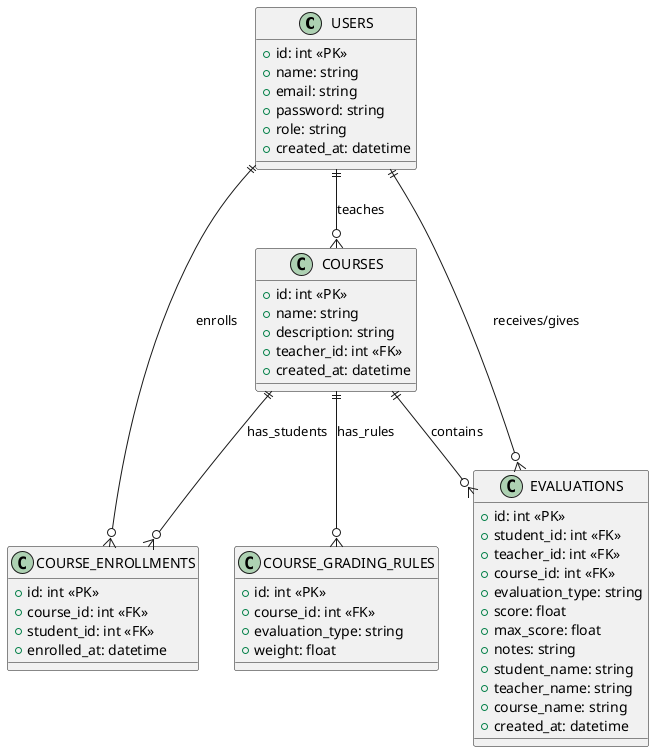
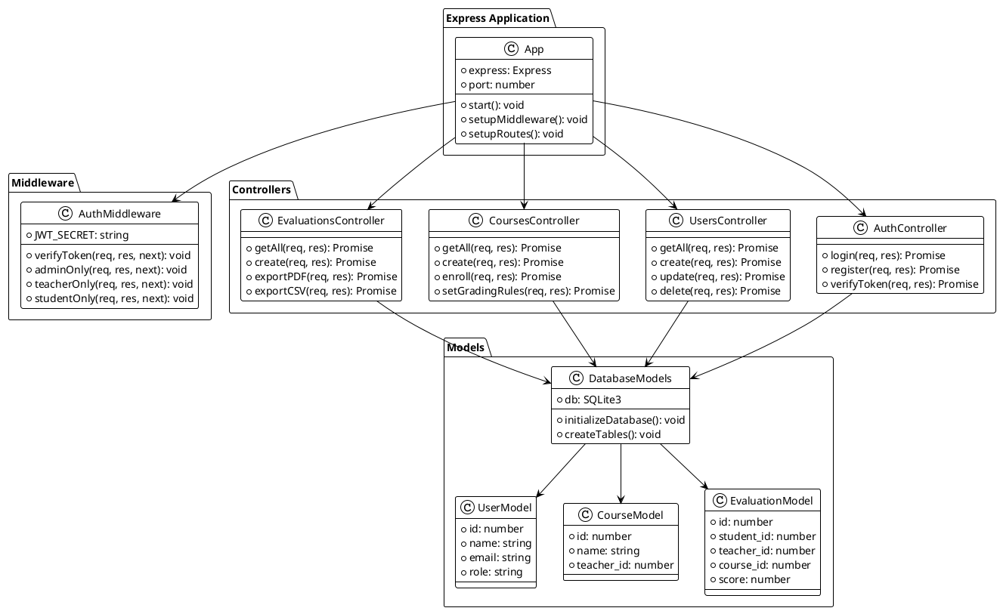
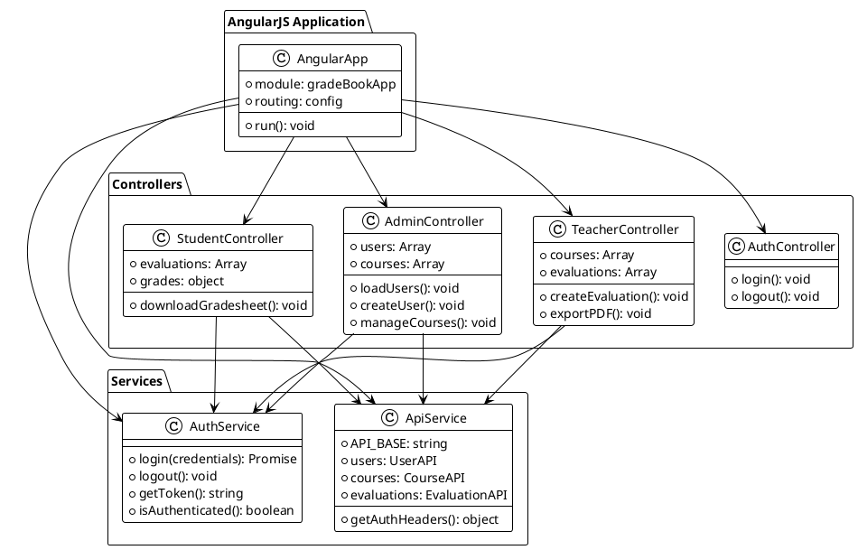
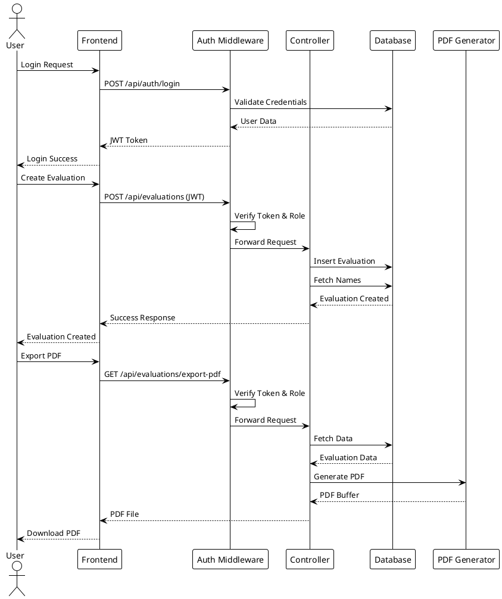
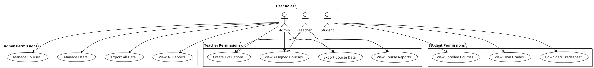

# Grade Book Application - Visual UML Diagrams

## How to Generate Visual Diagrams

The UML diagrams in this project use Mermaid syntax, which can be rendered as images in several ways:

### Option 1: GitHub (Automatic Rendering)
When you push this to GitHub, the Mermaid diagrams will automatically render as images in the README and UML_DIAGRAM.md files.

### Option 2: VS Code with Mermaid Extension
1. Install the "Mermaid Preview" extension in VS Code
2. Open `UML_DIAGRAM.md`
3. Use Ctrl+Shift+P → "Mermaid: Preview"
4. Export as PNG/SVG

### Option 3: Online Mermaid Editor
1. Go to https://mermaid.live/
2. Copy the Mermaid code from `UML_DIAGRAM.md`
3. Paste it in the editor
4. Download as PNG/SVG

### Option 4: PlantUML Alternative Diagrams

Here are the same diagrams in PlantUML format for generating images:

## Database Schema (PlantUML)



## Backend Architecture (PlantUML)



## Frontend Architecture (PlantUML)



## System Flow (PlantUML)



## Role-Based Access (PlantUML)



## To Generate Images:

### Method 1: PlantUML Online
1. Go to http://www.plantuml.com/plantuml/uml/
2. Copy any of the PlantUML code blocks above
3. Paste and generate PNG/SVG

### Method 2: PlantUML Extension for VS Code
1. Install "PlantUML" extension
2. Create .puml files with the code above
3. Use Alt+D to preview
4. Export as images

### Method 3: Command Line (if you have PlantUML installed)
```bash
plantuml -tpng diagram.puml
```

### Method 4: GitHub Integration
The Mermaid diagrams in UML_DIAGRAM.md will automatically render as images when viewed on GitHub.

## Quick Image Generation Links:

For immediate image generation, you can use these online tools:
- **Mermaid Live**: https://mermaid.live/
- **PlantUML Online**: http://www.plantuml.com/plantuml/
- **Draw.io**: https://app.diagrams.net/ (manual recreation)

The diagrams above provide complete visual documentation of your Grade Book application architecture!
