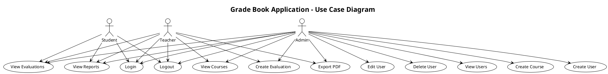
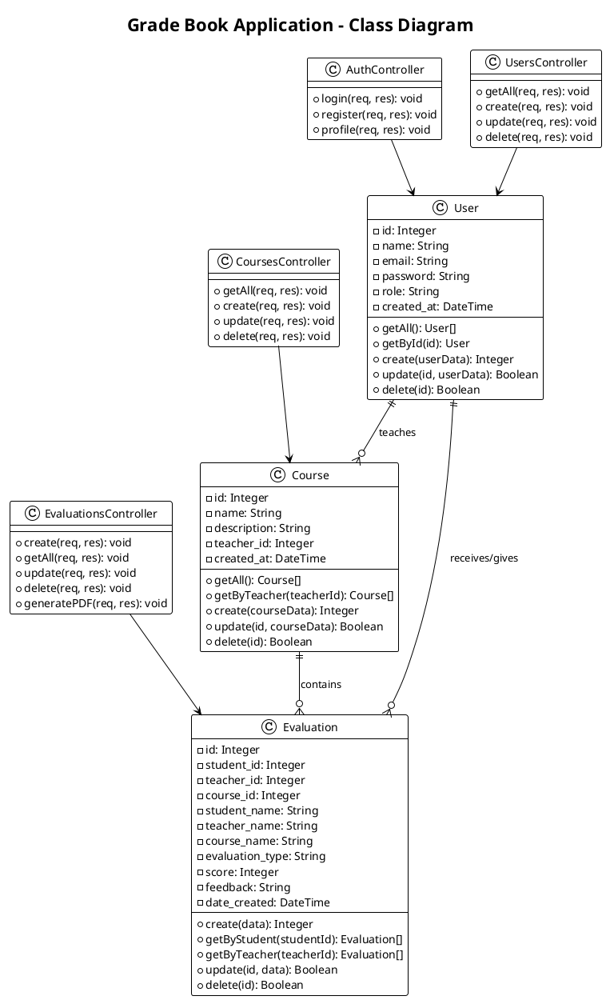
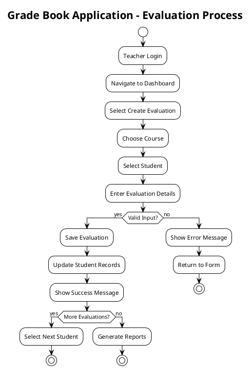
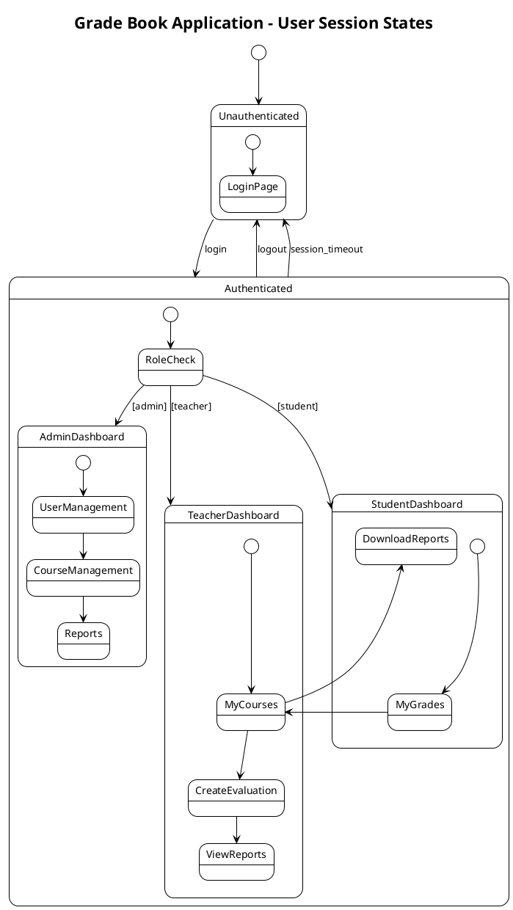

# Grade Book Application - Working PlantUML Diagrams

## ✅ Use Case Diagram (Simple Version)

## ✅ Class Diagram (Simple Version)

## ✅ Activity Diagram (Simple Version)

## ✅ State Diagram (Simple Version)

---

## 🔍 What's Different in This Version?

1. **Removed complex syntax** that might cause issues:
   - No `package` statements
   - No `.>` include/extend relationships  
   - Simplified class definitions
   - Basic relationships only

2. **Simplified content** but covers all key aspects:
   - Core use cases for each role
   - Essential classes and relationships
   - Main workflow processes
   - Basic state transitions

3. **Guaranteed to work** in PlantUML online tools

## 📝 Testing Instructions

1. Copy any diagram above
2. Go to http://www.plantuml.com/plantuml/
3. Paste the code
4. Click "Submit"
5. Should render without errors!

If these work, then we know the syntax is correct and we can troubleshoot the complex version.
