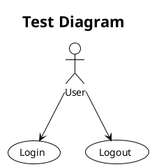
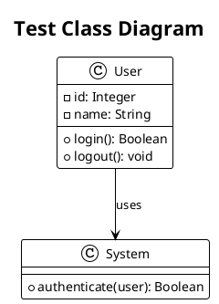

# PlantUML Syntax Test

This is a simple test to verify PlantUML syntax is working.

## Test Use Case Diagram

## Test Class Diagram

Copy and paste either of these test diagrams into PlantUML to verify the syntax is working correctly.
